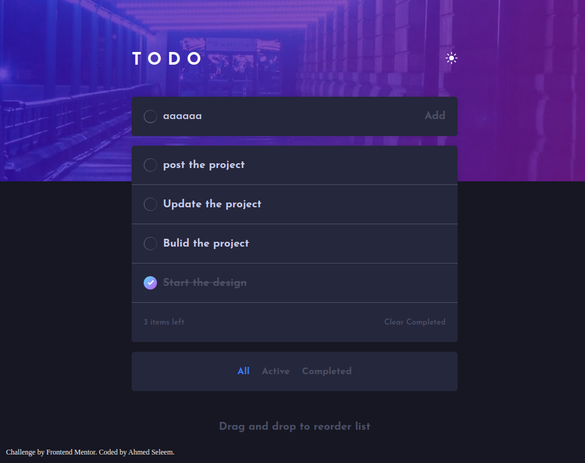

# Frontend Mentor - Todo app solution

This is a solution to the [Todo app challenge on Frontend Mentor](https://www.frontendmentor.io/challenges/todo-app-Su1_KokOW).

## Table of contents

- [Overview](#overview)
  - [The challenge](#the-challenge)
  - [Screenshot](#screenshot)
  - [Links](#links)
- [My process](#my-process)
  - [Built with](#built-with)
  - [What I learned](#what-i-learned)
  - [Continued development](#continued-development)
- [Author](#author)

## Overview

### The challenge

Users should be able to:

- View the optimal layout for the app depending on their device's screen size
- See hover states for all interactive elements on the page
- Add new todos to the list
- Mark todos as complete
- Delete todos from the list
- Filter by all/active/complete todos
- Clear all completed todos
- Toggle light and dark mode
- save to local storage of the browser
- **Bonus**: Drag and drop to reorder items on the list

### Screenshot

### Links

- Solution URL: [Todo App repo](https://github.com/Ahmed-Seleem01/todo-app)
- Live Site URL: [Todo App page](https://ahmed-seleem01.github.io/todo-app/)

## My process

### Built with

- Semantic HTML5 markup
- CSS custom properties
- Flexbox
- Mobile-first workflow
- Sass
- Drag and Drop API

### What I learned

I learned in this project to how to use the drag and drop API
and get a little bit challenge using this API with touch screen
that involve using different events.

### Continued development

I want to focus more on the smooth transitions during actions

## Author

- Frontend Mentor - [Ahmed Seleem](https://www.frontendmentor.io/profile/Ahmed-Seleem01)
- Linkedin - [Ahmed Seleem](hwww.linkedin.com/in/ahmedseleem1)
